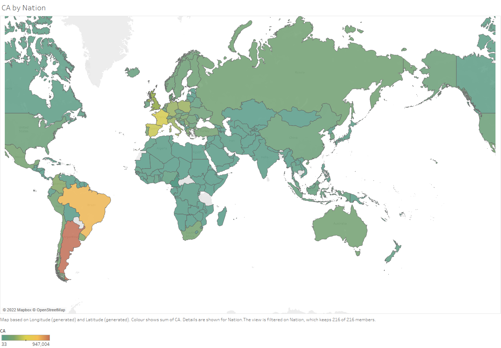

### Big Data Analytics on Football Manager Player Data

Welcome to this repository, where we delve deep into the world of football. Using the comprehensive dataset from Football Manager 2020, this notebook showcases advanced techniques of handling and analysing 'big data'. While it might not qualify as a 'big data' dataset by strict definitions, its impressive size (boasting 144,750 rows and 64 columns) makes it a significant playground for data enthusiasts and we have applied big data techniques for its analysis.

#### Highlights:

1. **Predictive Analysis**: This project doesn't just stick to one lane. We've made predictions on player "Value", their primary "Nation", where they're "Based", and even their "Best Pos" (optimal playing position).
2. **Varied Techniques**: From regression modelling to predict player "Value" to machine learning classifications like **Decision Tree, Logistic Regression, and Random Forest**, this analysis covers a broad spectrum of techniques.
3. **Pipelines with PySpark**: Keeping efficiency at the forefront, PySpark pipelines have been employed. This ensures that different models can be tested swiftly, especially after the data wrangling phase.

#### Technologies and Approach:

- **PySpark in Jupyter Notebook**: The core of our analysis, PySpark, offers the capability to handle large datasets with ease. Running within Jupyter Notebook, it provides a seamless interface for analysis and iterative development.
- **Tableau**: Before diving deep into the analysis, an exploratory study was conducted in Tableau. This visual approach made it easier to spot trends, outliers, and areas that required cleansing.

#### How It Works:

1. **Data Ingestion**: We start by loading the Football Manager 2020 dataset, a mammoth collection of player statistics, traits, and more.
2. **Exploratory Analysis**: Through visualisations and statistical measures, we get a feel for the dataset, identifying trends, outliers, and interesting patterns.
3. **Model Building & Analysis**: Using both traditional methods (like Linear Regression) and more advanced techniques, we build predictive models, perform clustering, and more, all to unearth deeper insights into the world of virtual football.

#### Delving Deeper:

The analysis began with a comprehensive exploratory phase in Tableau, which set the stage for subsequent in-depth analyses. This was not just about predicting values but also understanding patterns, relationships, and potential avenues of interest. Post this, the data was wrangled and cleansed, making it ripe for PySpark's powerful analytical capabilities.

A nice visualisation of cumulative player ability can be seen below, just a quick example of one of the plots contained within the [Report](Utilising%20Big%20Data%20Analytics%20techniques%20on%20Football%20Manager%20player%20data.pdf)

